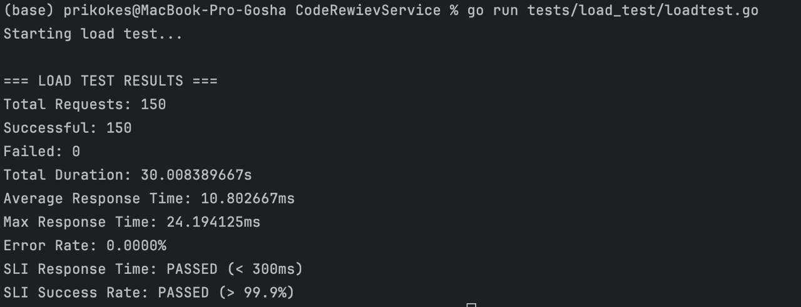

# Сервис назначения ревьюеров для Pull Request’ов

Автор: Иванов Георгий Ярославович 

Проект запускается выполнением команды в корне проекта 

```
docker-compose up
```

Для запуска проекта необходимо наличие следующих переменных окружения:
(значения даны в качестве примера).
```
DB_HOST=0.0.0.0
DB_USER=postgres
DB_PASSWORD=postgres
DB_NAME=code_review_db
DB_PORT=5432
APP_ADDRESS=0.0.0.0
APP_PORT=8080
```
Переменные окружения также могут быть загружены программой из .env файла.

Реализованы следующие дополнительные задания: 
- Добавить простой эндпоинт статистики (например, количество назначений по пользователям и/или по PR).
- Провести нагрузочное тестирование полученного решения и приложить краткие результаты тестирования к решению.
- Добавить метод массовой деактивации пользователей команды и безопасную переназначаемость открытых PR (стремиться уложиться в 100 мс для средних объёмов данных).
- Описать конфигурацию линтера.

**Эндпоинт статистики доступен по адресу /statistics.**

У него есть следующие функции: 
- Посчитать доступные статистики по команде (в качестве параметра требуется передать название команды)
- Посчитать доступные стастики по каждому участнику команды (в качестве параметра требуется название команды)

Статистики по команде можно получить по запросу к адресу **/statistics/team**

Статистики по каждому участнику команды можно получить по запросу к адресу **/statistics/team/users**

**Результаты нагрузочного тестирования:** 
Видно, что заявленные критерии выполнены


**Метод массовой деактивации пользователей команды:**
Я решил привязать его к ручке команд и данный метод доступен по пути **/team/deactivate**

Данный метод деактивирует всех пользователей команды (имя команды передается в качестве параметра запроса).

**Конфигурация линтера описана в файле .golangci.yml**

В ходе решения мне пришлось принять решение по нескольким вопросам:

- Что делать если в методе Reassign передается пользователь, который не был назначен на данный pr? Выкидывается ошибка 409. 
- Что делать с открытыми PR при массовой деактивации пользователей команды? У них просто пропадают Reviewers. 
